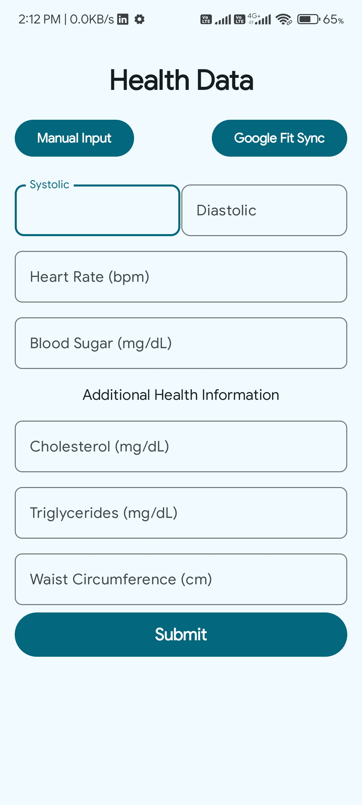
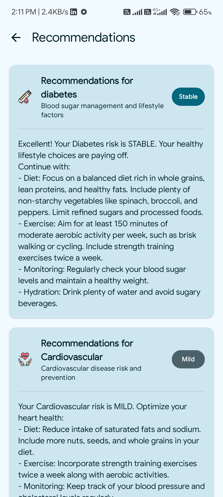
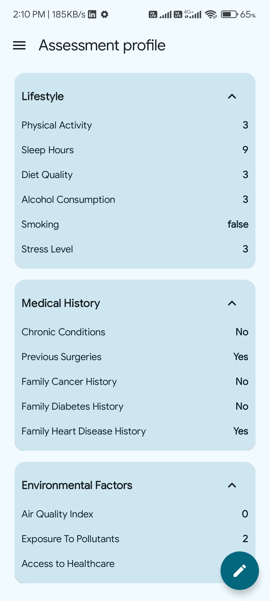

# WellnessWise Android  

## Introduction  
The primary objective of the proposed project is to develop a mobile application that serves as a comprehensive guide and navigator for users on their path towards wellness. Through the utilization of artificial intelligence (AI) technologies, the application aims to analyze user data and provide personalized health predictions, recommendations, and insights. By capturing user inputs such as medical history, lifestyle habits, and real-time health data, the application will leverage advanced algorithms to assess health risks, predict potential outcomes, and offer actionable strategies for improving overall well-being. The overarching goal is to empower users to make informed decisions about their health and lifestyle choices, leading to better health outcomes and enhanced quality of life.  

---

## 🚀 Technologies Used  

- **Kotlin** – Primary programming language for Android development.  
- **Jetpack Compose** – Modern UI toolkit for building native interfaces.  
- **Firebase** – Backend-as-a-Service for authentication and real-time database.  
- **Firestore** – NoSQL database for storing and syncing user data.  
- **TensorFlow** – Used for training machine learning models.  
- **TensorFlow Lite** – Optimized for mobile AI model integration.  
- **MPAndroidChart** – Library for rendering beautiful, interactive charts.
## Screenshots

1. **Login**  
   

2. **Sign Up**  
   

3. **Welcome Screen**  
   

4. **Health Input**  
   
   
5. **Home Screen**  
   

6. **Predictions**  
   

7. **Visualizations**  
    

8. **Recommendations**  
    

9. **Assessment Profile**  
   

10. **Menu**  
   

11. **Edit Profile**  
   

12. **User Profile**  
    

